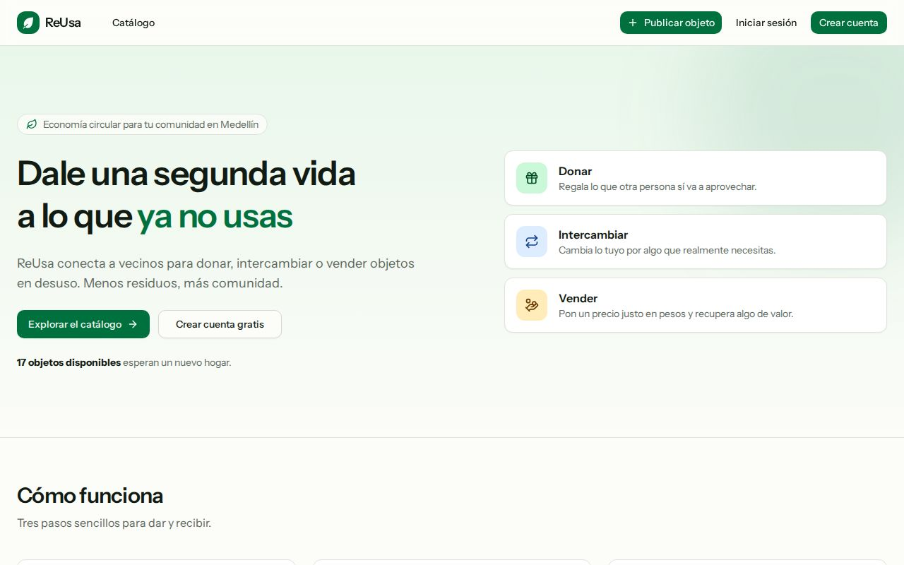
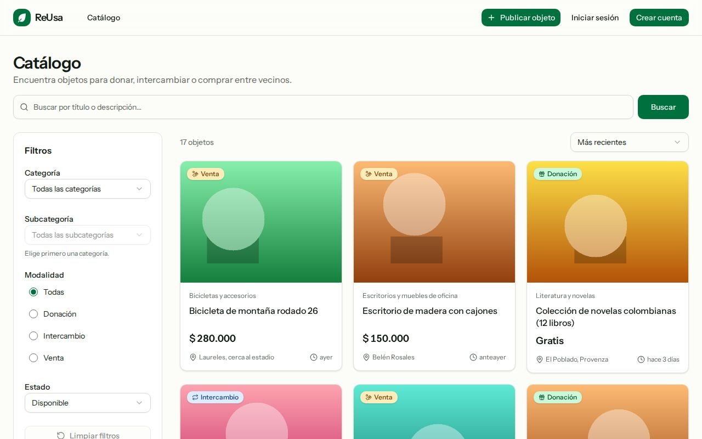
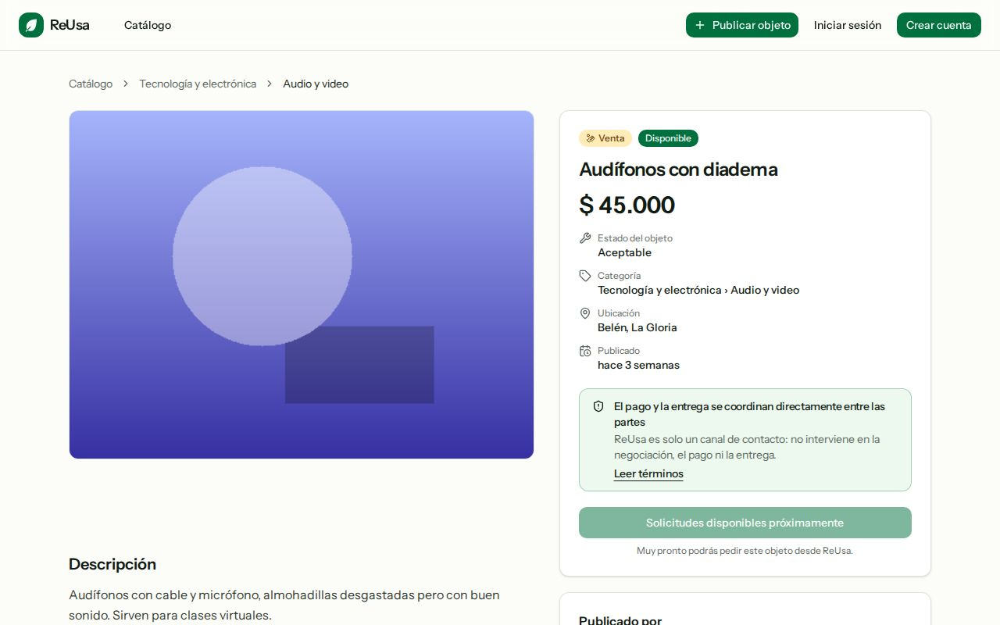
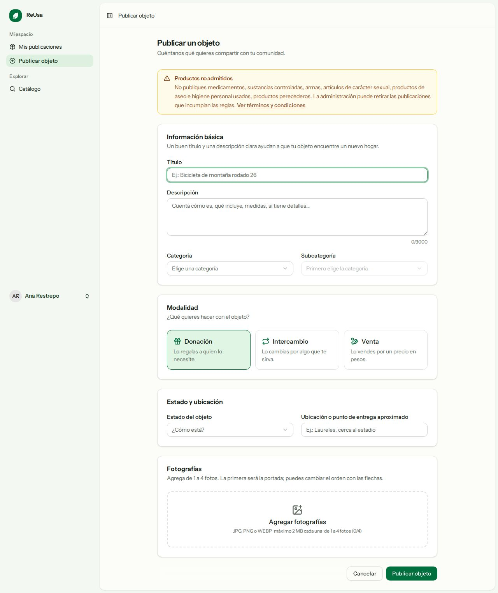
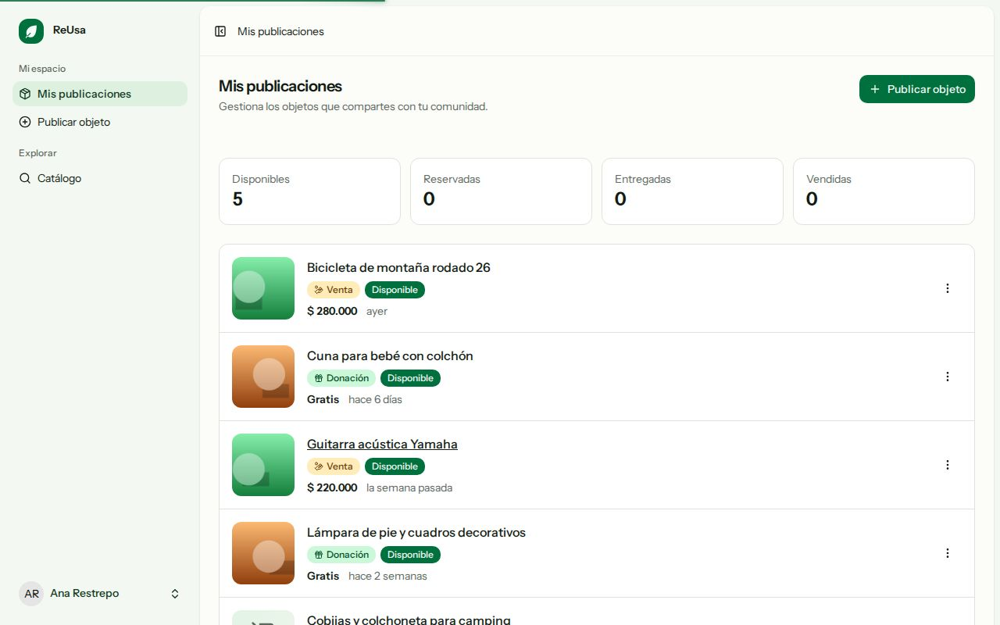
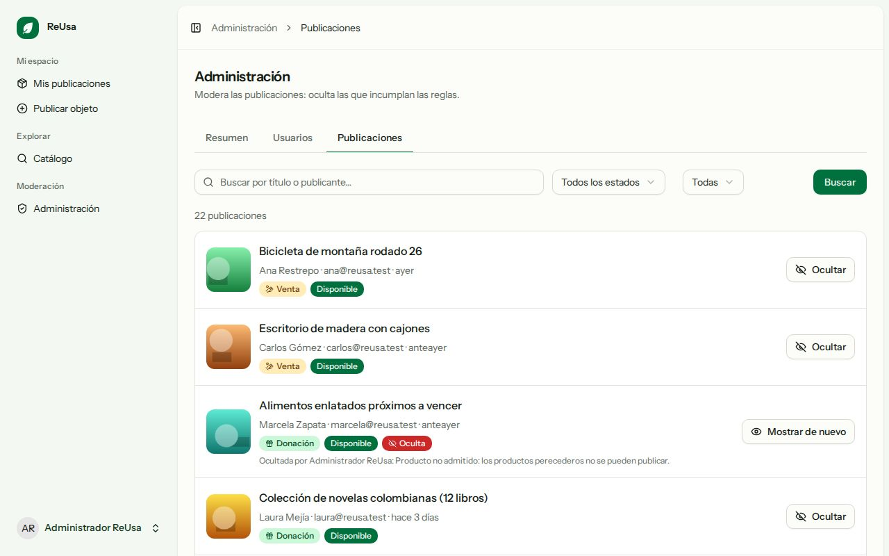
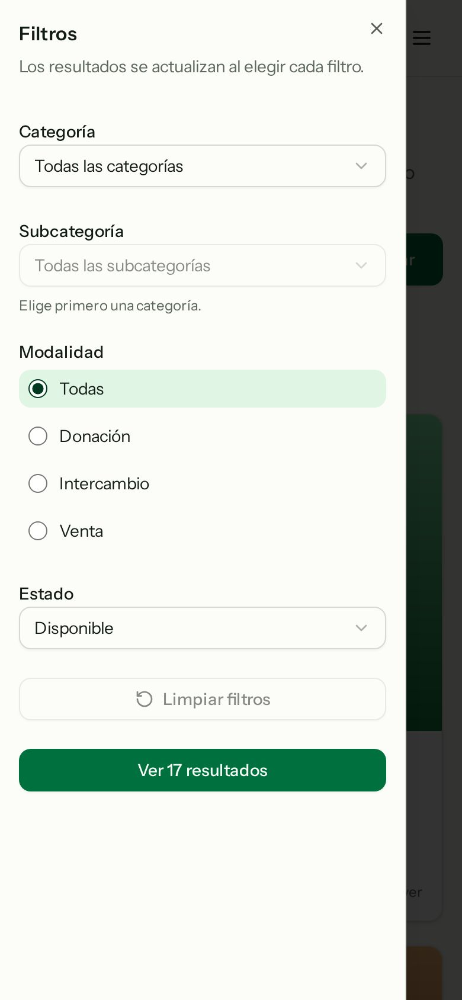

# ReUsa

Plataforma web de **economía circular comunitaria**: los miembros de una comunidad piloto en Medellín pueden **donar, intercambiar o vender** objetos en desuso. Proyecto Integrador del Politécnico Colombiano Jaime Isaza Cadavid, alineado con el **ODS 12** (producción y consumo responsables).

> ReUsa actúa únicamente como **canal de contacto** entre usuarios. No interviene en la negociación, el pago, la entrega ni la verificación de los objetos (ver la página de [términos y condiciones](resources/js/pages/terms.tsx) dentro de la aplicación). Cuando una publicación es una venta, solo se **muestra el precio**: no hay pasarelas de pago.



## Qué incluye este avance

| Área                 | Funcionalidad                                                                                                                                                                                                                                                          |
| -------------------- | ---------------------------------------------------------------------------------------------------------------------------------------------------------------------------------------------------------------------------------------------------------------------- |
| **Usuarios**         | Registro con aceptación de términos, inicio y cierre de sesión, recuperación de contraseña, edición de perfil (teléfono y comunidad opcionales), roles `user` / `admin`, cuentas desactivables (no pueden iniciar sesión).                                             |
| **Categorías**       | Dos niveles (macro → micro) en una tabla autorreferenciada; 8 macrocategorías y 30 microcategorías sembradas. Una publicación solo se asocia a una microcategoría.                                                                                                     |
| **Publicaciones**    | Crear, editar, eliminar (soft delete) y ver; modalidades donación / intercambio / venta; precio en COP solo para ventas; 1 a 4 fotos (jpg/png/webp, 2 MB) con previsualización y orden; estados `available`, `reserved`, `delivered`, `sold` con reglas de transición. |
| **Catálogo público** | Búsqueda, filtros por categoría, subcategoría, modalidad y estado, orden (recientes / precio), paginación; los filtros viven en la URL y la paginación los conserva. Por defecto solo muestra publicaciones disponibles.                                               |
| **Administración**   | Resumen con contadores, gestión de usuarios (activar/desactivar, cambiar rol) y moderación de publicaciones (ocultar con motivo opcional / mostrar de nuevo). Un admin no puede desactivarse ni quitarse el rol a sí mismo.                                            |
| **Interfaz**         | En español (es-CO), responsive (móvil primero), modo claro y oscuro, accesibilidad AA verificada con axe-core.                                                                                                                                                         |

Lo que **no** incluye todavía (flujo de solicitudes, notificaciones, chat, pagos…) está en [`docs/BACKLOG.md`](docs/BACKLOG.md). En el detalle de cada publicación hay un botón deshabilitado «Solicitudes disponibles próximamente».

## Stack

- **Backend:** Laravel 13, PHP 8.4, Fortify (autenticación), Eloquent, Form Requests, Policies, Actions.
- **Frontend:** React 19 + TypeScript, Inertia 3, Tailwind CSS 4, shadcn/ui, Wayfinder (rutas tipadas), Vite+.
- **Base de datos:** MySQL 8 en desarrollo (SQLite también funciona). Las pruebas usan SQLite en memoria. El código no usa SQL específico de un motor.
- **Calidad:** Pest 5, Laravel Pint, Larastan (PHPStan nivel 7), `vp check` (formato y lint), `tsc --noEmit`.

## Requisitos

- **PHP ≥ 8.4** con las extensiones `pdo_mysql` (o `pdo_sqlite`), `mbstring`, `fileinfo`, `zip`, `tokenizer`, `xml`, `curl`, `openssl`. _No_ se necesita GD.
- **Composer 2**
- **Node.js ≥ 22** y npm
- **MySQL 8** (o usar SQLite, ver más abajo)

### Configuración de PHP para las fotografías

Cada publicación admite hasta 4 fotos de 2 MB. Revisa tu `php.ini`:

```ini
upload_max_filesize = 3M
post_max_size = 12M
```

Los valores por defecto de PHP (`2M` y `8M`) rechazan fotos justo en el límite. La aplicación valida en el navegador (tipo, 2 MB por foto y 7,5 MB en total) y en el servidor.

## Instalación

```bash
git clone <url-del-repositorio> reusa
cd reusa

composer install
npm install

cp .env.example .env
php artisan key:generate
```

Crea la base de datos en MySQL (o salta al apartado de SQLite):

```sql
CREATE DATABASE reusa CHARACTER SET utf8mb4 COLLATE utf8mb4_unicode_ci;
```

Ajusta `DB_USERNAME` y `DB_PASSWORD` en `.env` si no usas `root` sin contraseña. Luego:

```bash
php artisan migrate --seed     # tablas, categorías, usuarios y publicaciones de demostración
php artisan storage:link       # expone las fotografías de storage/app/public
npm run build                  # o usa «composer dev» para desarrollo con recarga
composer dev                   # servidor, cola, logs y Vite
```

Abre <http://localhost:8000>.

> Atajo: `composer setup` hace instalación, `.env`, clave, migraciones con datos de demostración, `storage:link` y build en un solo paso.

### Usar SQLite en lugar de MySQL

En `.env` cambia `DB_CONNECTION=sqlite`, **comenta todas** las líneas `DB_HOST`…`DB_PASSWORD` (incluida `DB_DATABASE`) y crea el archivo:

```bash
touch database/database.sqlite
php artisan migrate --seed
```

## Usuarios de demostración

Solo para desarrollo. Las cuentas y la contraseña pública `password` las crea el seeder; **no se siembran en producción** (`APP_ENV=production`), donde solo se cargan las categorías.

| Rol           | Correo               | Contraseña |
| ------------- | -------------------- | ---------- |
| Administrador | `admin@reusa.test`   | `password` |
| Usuario       | `ana@reusa.test`     | `password` |
| Usuario       | `carlos@reusa.test`  | `password` |
| Usuario       | `laura@reusa.test`   | `password` |
| Usuario       | `jorge@reusa.test`   | `password` |
| Usuario       | `marcela@reusa.test` | `password` |

Los datos incluyen 22 publicaciones de ejemplo en todas las modalidades y estados (una oculta por moderación y una sin fotos). Las fotografías son imágenes PNG generadas localmente, así que el proyecto funciona sin internet.

## Comandos útiles

```bash
composer dev            # entorno de desarrollo (servidor + Vite + cola + logs)
composer test           # Pint (--test) + PHPStan + toda la suite de pruebas
composer ci:check       # lo anterior más lint, formato y tipos del frontend (lo que corre el CI)

php artisan test        # solo las pruebas de Pest
vendor/bin/pint         # corrige el estilo de PHP
vendor/bin/phpstan analyse --memory-limit=1G
npm run check           # formato y lint del frontend (vp check); `npm run check:fix` corrige
npm run types:check     # tsc --noEmit
npm run build           # compilación de producción
```

Las pruebas no necesitan `npm run build` ni MySQL: usan SQLite en memoria y desactivan Vite.

### Qué cubren las pruebas

- **Feature:** registro (con y sin términos, límite de intentos), inicio de sesión, usuario desactivado, protección de rutas por rol, creación / edición / eliminación de publicaciones (caminos felices y de error), precio por modalidad, validación de fotos (cantidad, tipo, tamaño, contenido real) con `Storage::fake`, autorización (nadie edita lo ajeno; el admin solo modera), catálogo con cada filtro y sus combinaciones, paginación que conserva filtros, transiciones de estado válidas e inválidas, panel de administración y datos de demostración.
- **Unit:** enums (incluida la tabla de verdad completa de transiciones), scopes de Eloquent, Actions, DTO, filtros, políticas y utilidades.

## Estructura del proyecto

```
app/
├── Actions/            Lógica de negocio: Publications/, Admin/, Users/, Fortify/
├── Enums/              UserRole, PublicationModality, PublicationStatus, ItemCondition, PublicationSort
├── Exceptions/         InvalidStatusTransition
├── Http/
│   ├── Controllers/    Delgados; Admin/ para el panel
│   ├── Middleware/     admin, active, ThrottleRegistration, HandleInertiaRequests
│   ├── Requests/       Validación (Publications/, Admin/, Settings/)
│   └── Resources/      Lo que viaja al frontend (nunca modelos completos)
├── Models/             User, Category, Publication, PublicationImage
├── Policies/           PublicationPolicy, UserPolicy
├── Rules/              LeafCategory
└── Support/            PublicationFilters, EnumOptions, LikePattern
database/               migraciones, factories y seeders (Demo*, Support/PlaceholderImage)
lang/es/                traducciones (validación, autenticación, mensajes)
resources/js/
├── components/         ui/ (shadcn), publications/, admin/ y utilidades
├── layouts/            public-layout, app (barra lateral), auth, settings
├── pages/              welcome, terms, publications/, my/, admin/, auth/, settings/
└── lib/ hooks/ types/  formato es-CO, catálogo, tipos compartidos
routes/                 web.php, admin.php, settings.php
tests/                  Feature/ y Unit/ (Pest)
docs/                   plan de implementación, backlog, guion de demo, capturas
```

## Decisiones principales

- **Un solo rol de cuenta.** No hay «oferente» y «solicitante»: la misma cuenta publica y, más adelante, solicitará objetos. Dos roles (`user`/`admin`) no justifican una librería de permisos: enum respaldado + columna + Policies.
- **Reglas de estado centralizadas** en `PublicationStatus` y probadas con tabla de verdad: `reserved ↔ available`; `sold` solo en ventas y `delivered` en donaciones e intercambios; ambos son finales.
- **Precio entero en COP**, sin decimales; obligatorio solo en ventas. El servidor lo anula si la modalidad no es venta.
- **Enlaces legibles y estables:** `bicicleta-de-montana-x7k2qd`. El slug no cambia si se edita el título.
- **Fotografías en un solo endpoint:** el formulario envía `images[]` (archivos nuevos) e `image_order[]` (tokens `existing:{id}` / `new:{n}`), con lo que agregar, quitar y reordenar es una operación atómica.
- **Moderación sin tabla extra:** `hidden_at`, `hidden_reason`, `hidden_by` en `publications`. Una publicación oculta desaparece del catálogo y del detalle para terceros; su dueño la sigue viendo con el motivo.
- **Sin GD ni internet:** la fuente tipográfica está autoalojada (`@fontsource-variable`) y las imágenes de demostración se generan con PHP puro.
- **Datos sensibles:** el correo y el teléfono nunca llegan al frontend público; las props de Inertia salen de API Resources explícitos. `Model::preventLazyLoading()` evita consultas N+1 fuera de producción.
- **Seguridad:** `declare(strict_types=1)`, asignación masiva protegida (`role`, `is_active`, `status` y campos de moderación no son asignables), validación de archivos por contenido real, límite de intentos en inicio de sesión y registro, autorización en cada acción de escritura.

## Capturas

| Catálogo                                                 | Detalle                                                |
| -------------------------------------------------------- | ------------------------------------------------------ |
|  |  |

| Publicar                                                   | Mis publicaciones                                               |
| ---------------------------------------------------------- | --------------------------------------------------------------- |
|  |  |

| Administración                                             | Móvil                                                      |
| ---------------------------------------------------------- | ---------------------------------------------------------- |
|  |  |

Más capturas en [`docs/screenshots/`](docs/screenshots/).

## Documentación

- [`docs/IMPLEMENTATION_PLAN.md`](docs/IMPLEMENTATION_PLAN.md): plan aprobado y estado real.
- [`docs/BACKLOG.md`](docs/BACKLOG.md): lo que sigue (solicitudes, orientación, administración avanzada…).
- [`docs/DEMO.md`](docs/DEMO.md): guion de demostración de 3 a 5 minutos.
